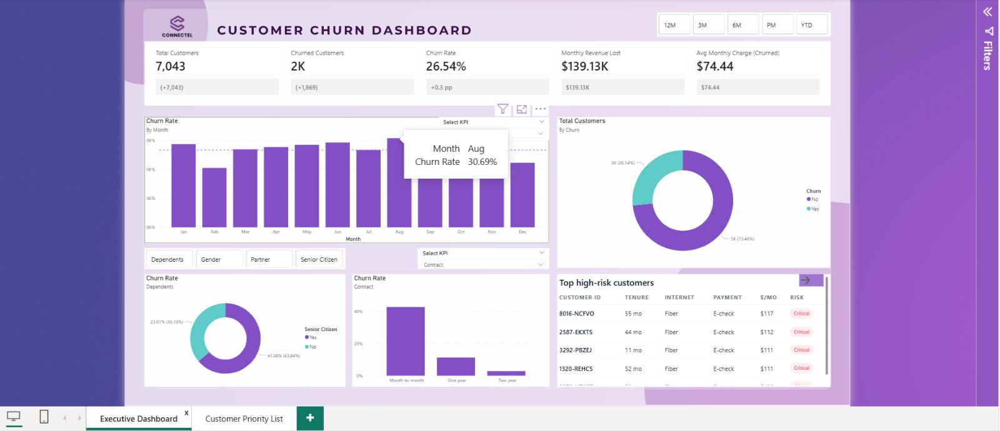
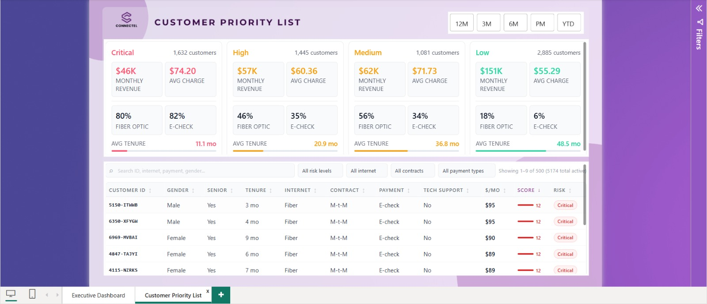

# Customer Churn Dashboard - Power BI

## Overview
This project analyzes telecom customer churn data using Power BI to identify churn patterns, customer risk levels, revenue impact, and retention opportunities.

## Tools Used
- Power BI
- Power Query
- DAX
- Excel

## Dataset
- IBM Telco Customer Churn Dataset
- 7,043 customer records

## Dashboard Preview

### Customer Churn Dashboard

### Customer Priority List

## How to View

1. Download `Customer_Churn_Dashboard.pbix`
2. Open it using Microsoft Power BI Desktop.
3. Explore the **Executive Dashboard** and **Customer Priority List** pages.
4. Interact with filters, slicers, and KPI visuals to analyze customer churn patterns and risk segments.

## Key KPIs
- Total Customers
- Churned Customers
- Churn Rate
- Monthly Revenue Lost
- Average Monthly Charge

## Key Insights
- Month-to-month customers show the highest churn.
- Customers with shorter tenure are more likely to churn.
- Electronic check users have higher churn risk.
- Risk scoring helps prioritize retention efforts.

## Skills Demonstrated
- Data Cleaning
- Data Modeling
- DAX Calculations
- KPI Development
- Business Intelligence
- Data Visualization

## Author
Kiruba Joyce X
